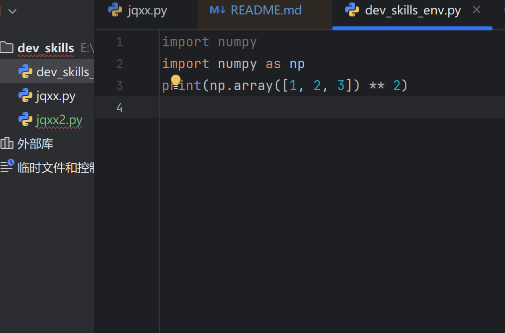
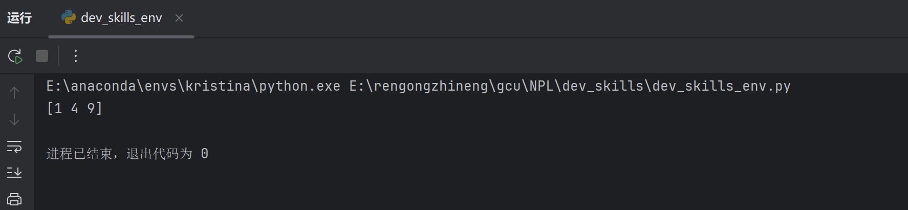

# TFBOYS的自我介绍
大家好，我们是**TFBOYS**，由王俊凯、王源和易烊千玺三位成员组成，来自中国的*歌手*、*演员*和*舞者*。自2013年出道以来，我们一直努力在音乐、影视等领域不断进步，希望能为大家带来更多优秀的作品。

---

## 基本信息
- **成立时间**：2013年8月6日  
- **成员**：王俊凯、王源、易烊千玺  
- **粉丝名称**：四叶草  
- **粉丝应援色**：橙色  
- **经纪公司**：北京时代峰峻文化艺术发展有限公司

---

## 出道经历
我们通过TF家族练习生计划相识，并于2013年以TFBOYS组合正式出道。出道初期以青春活力的形象和正能量歌曲迅速走红，成为国内备受瞩目的少年偶像组合。

---

## 爱好与理想
- **王俊凯**：喜欢唱歌、跳舞和表演，理想是成为一名全能艺人。

  

- **王源**：热爱音乐创作和公益，希望用音乐传递爱与力量。  

- **易烊千玺**：擅长舞蹈、书法和表演，目标是成为有影响力的艺术家。

  

---

## 行程安排表
以下是我们的近期行程安排，期待与大家见面！

| 日期       | 活动内容               | 地点           |
|------------|------------------------|----------------|
| 2023-8-6| 十年之约演唱会          | 西安           |
| 2023-11-15 | 综艺节目录制           | 上海           |
| 2023-11-20 | 粉丝见面会             | 广州           |
| 2023-11-25 | 电影首映礼             | 成都           |
| 2023-11-30 | 公益演唱会             | 深圳           |

  
---

## 组合成就与获奖经历
- **音乐成就**：  
  - 单曲《青春修炼手册》成为国民级神曲  
  - 专辑《大梦想家》销量突破百万  
- **获奖经历**：  
  - 多次获得音乐风云榜、东方风云榜等音乐奖项  
  - 荣获亚洲新歌榜年度最佳组合  
  - 获得MTV欧洲音乐大奖“最佳中国艺人”
  - 获得第1届腾讯音乐娱乐盛典“年度最受欢迎团体奖”和“年度最佳团体奖”  

---

## 个人成就与荣誉
- **王俊凯**：  
  - 主演电影《解忧杂货店》、《万里归途》、《野孩子》、电视剧《天坑鹰猎》、《重生之门》  
  - 荣获第17届中国电影表演艺术学会奖新人奖  
- **王源**：  
  - 原创音乐作品《十七》、《骄傲》等  
  - 联合国儿童基金会青年教育使者  
- **易烊千玺**：  
  - 主演电影《少年的你》、《长津湖》、《小小的我》
  - 荣获第39届香港电影金像奖最佳新演员  

---

## 外貌特征
- **王俊凯**：阳光帅气，笑容温暖，身高180cm+  
- **王源**：清新可爱，眼神灵动，身高175cm+  
- **易烊千玺**：沉稳内敛，气质独特，身高178cm+  

---

## 组合音乐与影视作品
- **音乐作品**：  
 - 《青春修炼手册》  
 - 《魔法城堡》
 - 《Heart》
 - 《宠爱》  
 - 《大梦想家》
 - 《我们的时光》
 - 《是你》
 - 《明天见》

[点击播放《青春修炼手册》](https://music.163.com/song?id=28838178) 

- **影视作品**：  
 - 电视剧《超少年密码》  、《青云志》 
 - 网络剧《我们的少年时代》 

---

## 个人音乐与影视作品
- **王俊凯**：  
  - 音乐：《树读》、《流星》  
  - 影视：《天坑鹰猎》、《刺猬》  、《749局》    
- **王源**：  
  - 音乐：《十七》、《骄傲》 、《Back to Life》   
  - 影视：《地久天长》、《灿烂！灿烂》  
- **易烊千玺**：  
  - 音乐：《离骚》、《My Boo》  
  - 影视：《少年的你》、《长津湖》、《奇迹·笨小孩》  

---

## 粉丝信息
我们的粉丝叫做 **四叶草**，这个名字象征着幸运和希望。四叶草们一直陪伴着我们，给予我们无尽的支持和鼓励。无论是在舞台上还是生活中，你们的每一份爱都让我们感到无比温暖和感动。

---

## 对粉丝的感谢
我们想对所有的四叶草们说一声：**谢谢你们！**  
是你们的支持和陪伴，让我们有勇气面对每一个挑战，勇敢追逐梦想。无论未来有多远，我们都会继续努力，不辜负你们的期望。希望我们能一直在一起，共同创造更多美好的回忆！
[点击观看TFBOYSMV](https://www.bilibili.com/video/BV1Sx411J7nz/?spm_id_from=333.337.search-card.all.click)

---

## 对未来的期许
未来，我们会继续在音乐、影视等领域不断突破自我，用更好的作品回馈大家的支持。我们相信，只要心中有梦想，脚下有力量，就一定能走得更远！  

**TFBOYS，未来可期！**

##我最喜欢的一段代码
dev_skills_env.py中你的代码

 
其中执行
`mport numpy`
`import numpy as np`
`print(np.array([1, 2, 3]) ** 2)`可输出结果

我最喜欢的环境管理工具是conda
“01 环境搭建的截图一”
 
我可以在IDE上使用我建立的虚拟环境
“01 环境搭建的截图一”
 
 
